# 督察APP 需求说明

## 1. 概述

- **目的**：重构督察APP页面设计。
- **范围**：问题 / 督察 / 地图 / 支持；不含「我的」与登录注册等。
- **写法**：按用户操作路径说明能力与字段；截图仅作界面佐证，不限定最终实现形态。字段表：「数据来源」仅字典字段填写，其余留空，不写「接口」；「备注」仅字典项填写可选值；非表单字段表另增「是否字典项」列（是 / 否）；表单字段表另增「是否必填」「组件类型」列。
- **模拟数据**：仅列表、详情、表单提供样例；字典可选值已在字段表备注列，筛选条件不另附模拟数据。
- **共用页**：同一界面只在首次入口写全文；其它入口写明「与某某页面一致」，并注明点击后跳转至该节（如 §4.1.3）同一页面。

## 3. 全局导航与业务树

主导航依次为：**问题 → 督察 → 地图 → 支持**。进入 App 后可进入对应功能。

```
问题
├─ 清单问题列表
│  ├─ 搜索与更多条件
│  └─ 问题管理 / 发起督导（全文）
├─ 线索问题列表 → 线索详情 / 线索表单 / 现场核查（与督导表单一致 → §4.1.3）
└─ 督察问题列表 → 各类型详情 / 发起督导（与上文一致 → §4.1.3）
督察
└─ 督导列表（交办/督办/资料调阅/问责同督导）→ 详情/编辑/新增（与督导表单一致 → §4.1.3）
地图
└─ 督察地图 → 点选点位 → 地图详情
支持
└─ 资源列表
```

---

## 4. 问题

进入 **「问题」**，打开问题工作台。可在「清单问题 / 线索问题 / 督察问题」间切换。

### 4.1 清单问题列表

切换到 **「清单问题」**，进入清单问题列表。支持关键词搜索、更多条件筛选、列表展示与列表操作。

列表展示下列字段：

| 字段 | 是否字典项 | 数据来源 | 备注 |
|------|------------|----------|------|
| 问题标题 | 否 |  |  |
| 问题编码 | 否 |  |  |
| 整改责任单位 | 否 |  |  |
| 行业主管部门 | 否 |  |  |
| 问题来源 | 否 |  |  |
| 发生领域 | 否 |  |  |
| 督导状态 | 是 | 字典 `workbench_supervision_status` | 未核查 / 核查中 / 已核查 |
| 整改状态 | 是 | 字典 `workbench_work_status` | 未整改 / 整改中 / 已办结 |
| 临期/超期情况 | 是 | 字典 `workbench_deadline_status` | 正常 / 临期 / 超期 |
| 督导后风险 | 是 | 字典 `supervision_risk_level` | 未评估 / 低风险 / 中风险 / 高风险 |
| 整改期限 | 否 |  |  |
| 办结时间 | 否 |  |  |

列表为空时展示空态；获取失败时提示失败信息。

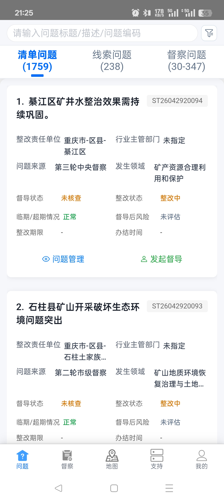

**模拟数据**（`mock.wbList`）：

```json
[
  {
    "问题标题": "綦江区矿井水整治效果需持续巩固",
    "问题编码": "ST26042920094",
    "整改责任单位": "重庆市-区县-綦江区",
    "行业主管部门": "未指定",
    "问题来源": "第三轮中央督察",
    "发生领域": "矿产资源合理利用和保护",
    "督导状态": "未核查",
    "整改状态": "整改中",
    "临期/超期情况": "正常",
    "督导后风险": "未评估",
    "整改期限": "-",
    "办结时间": "-"
  }
]
```

#### 4.1.1 搜索与更多条件

支持按问题标题 / 描述 / 问题编码检索（占位文案：「请输入问题标题/描述/问题编码」）。

支持打开「更多查询条件」，并提供 **取消 / 重置 / 确定**。条件如下（字典可选值见备注列，不另附模拟数据）：

| 字段 | 是否字典项 | 数据来源 | 备注 |
|------|------------|----------|------|
| 督导单位 | 否 |  |  |
| 问题来源 | 否 |  |  |
| 发生领域 | 否 |  |  |
| 整改状态 | 是 | 字典 `workbench_work_status` | 未整改 / 整改中 / 已办结 |
| 临期超期情况 | 是 | 字典 `workbench_deadline_status` | 正常 / 临期 / 超期 |
| 督导状态 | 是 | 字典 `workbench_supervision_status` | 未核查 / 核查中 / 已核查 |

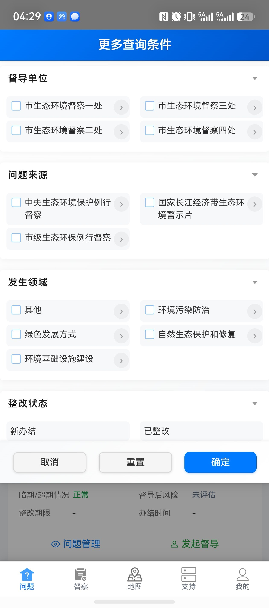

#### 4.1.2 问题管理（详情）

在清单列表点击 **「问题管理」**，进入 **问题详情**。


详情页标题为「问题详情」，支持分块查看：**问题详情 / 整改信息 / 督导信息 / 案例信息 / 位置信息**。可返回上一页。各区块无数据时可显示「暂无…」。

##### 问题详情

默认或切换到 **「问题详情」** 时，查看问题基本信息，字段如下：

| 字段 | 是否字典项 | 数据来源 | 备注 |
|------|------------|----------|------|
| 问题编号 | 否 |  |  |
| 创建时间 | 否 |  |  |
| 问题名称 | 否 |  |  |
| 所属清单 | 否 |  |  |
| 问题层级 | 是 | 字典 `problem_create_level` | 国家级 / 市级 / 区县级 |
| 问题发现时间 | 否 |  |  |
| 整改状态 | 是 | 字典 `problem_info_status` | 未整改 / 整改中 / 已办结 |
| 整改期限 | 否 |  |  |
| 问题描述 | 否 |  |  |
| 问题领域 | 否 |  |  |
| 问题来源 | 否 |  |  |
| 提出性质 | 否 |  |  |
| 发布层级 | 否 |  |  |
| 提出单位 | 否 |  |  |
| 建设布局 | 否 |  |  |
| 问题发生地 | 否 |  |  |
| 发生时间 | 否 |  |  |
| 发生原因 | 否 |  |  |
| 问题性质 | 否 |  |  |
| 风险类别 | 否 |  |  |
| 风险类型 | 否 |  |  |
| 牵头单位 | 否 |  |  |
| 主管部门 | 否 |  |  |
| 协同单位 | 否 |  |  |
| 行业主管部门 | 否 |  |  |
| 整改协同单位 | 否 |  |  |

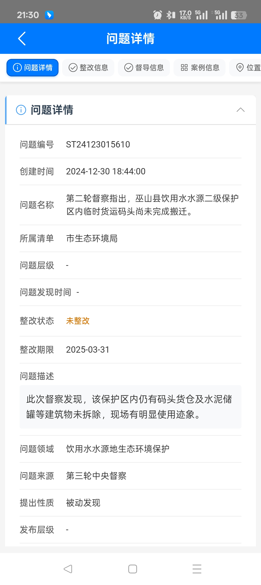

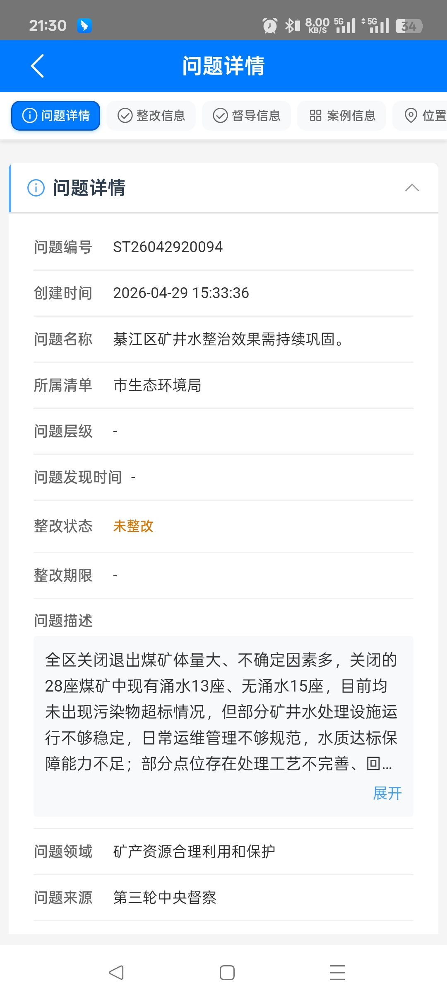

##### 整改信息

切换到 **「整改信息」**，查看整改措施列表；可进入措施详情或进展反馈。字段如下：

| 字段 | 是否字典项 | 数据来源 | 备注 |
|------|------------|----------|------|
| 部门名称 | 否 |  |  |
| 整改措施 | 否 |  |  |
| 进展反馈 | 否 |  |  |
| 完成情况 / 反馈完成情况 | 是 | 字典 `feed_complete_status` | 已完成 / 进行中 |
| 反馈时间 | 否 |  |  |
| 反馈内容（进展反馈） | 否 |  |  |

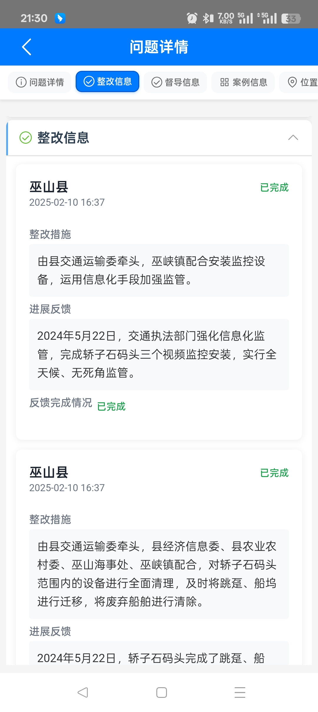

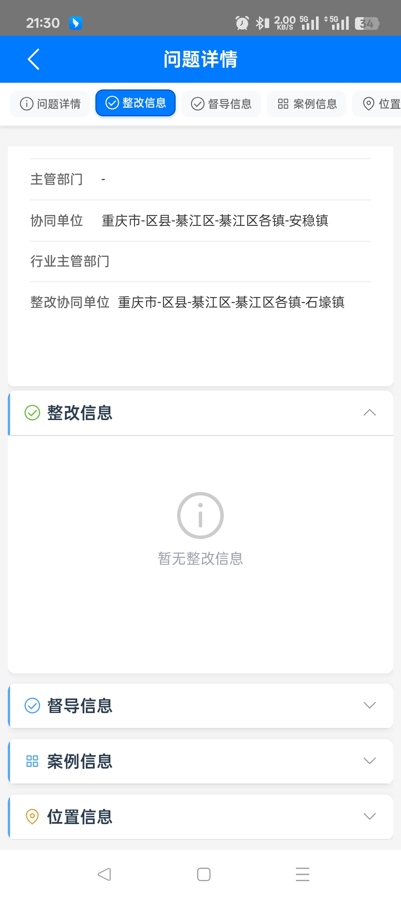

##### 督导信息

切换到 **「督导信息」**，查看该问题下的督导记录列表，字段如下：

| 字段 | 是否字典项 | 数据来源 | 备注 |
|------|------------|----------|------|
| 督导人员 | 否 |  |  |
| 督导时间 | 否 |  |  |
| 督导方式 | 是 | 字典 `supervision_method` | 现场检查 / 书面督导 / 视频督导 |
| 部门名称 | 否 |  |  |
| 风险等级 | 是 | 字典 `supervision_risk_level` | 未评估 / 低风险 / 中风险 / 高风险 |
| 线索评估 | 是 | 字典 `supervision_clue_evaluation` | 有效线索 / 无效线索 |
| 督导进度 | 否 |  |  |
| 督导状态 | 是 | 字典 `supervision_audit_status` | 待审核 / 审核通过 / 审核驳回 |
| 核查总体评价 | 是 | 字典 `overall_verification_evaluation` | 核查情况基本符合 / 核查发现整改有差距 / 核查发现整改不到位 / 核查发现虚假整改 |
| 市级例行督察 | 是 | 字典 `is_municipal_routine` | 是 / 否 |
| 督察组 | 否 |  |  |
| 督察批次 | 否 |  |  |
| 督察意见 | 否 |  |  |
| 核查情况 | 否 |  |  |
| 督办建议 | 否 |  |  |
| 图像附件 | 否 |  |  |
| 视频附件 | 否 |  |  |
| 问题移交函 | 否 |  |  |
| 督察督办函 | 否 |  |  |
| 约见 | 否 |  |  |
| 约谈 | 否 |  |  |
| 是否交办 | 是 | 字典 `is_assigned` | 交办 / 不交办 |

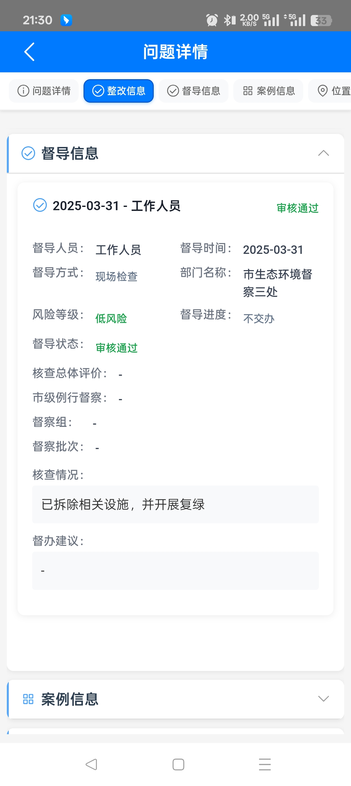

##### 案例信息

切换到 **「案例信息」**，查看案例相关字段：

| 字段 | 是否字典项 | 数据来源 | 备注 |
|------|------------|----------|------|
| 案例名称 | 否 |  |  |
| 报送单位 | 否 |  |  |
| 工作举措及成效 | 否 |  |  |

##### 位置信息

切换到 **「位置信息」**，可查看问题点位：

| 字段 | 是否字典项 | 数据来源 | 备注 |
|------|------------|----------|------|

**模拟数据**（`mock.problemMgmt`）：

```json
{
  "问题详情": {
    "问题编号": "ST24123015610",
    "创建时间": "2024-12-30",
    "问题名称": "巫山县饮用水水源二级保护区临时货运码头尚未完成搬迁",
    "所属清单": "第三轮中央生态环境保护督察问题清单",
    "问题层级": "国家级",
    "问题发现时间": "2024-11-15",
    "整改状态": "未整改",
    "整改期限": "2025-03-31",
    "问题描述": "二级保护区内临时货运码头尚未完成搬迁…",
    "问题领域": "饮用水水源地生态环境保护",
    "问题来源": "第三轮中央督察",
    "提出性质": "督察反馈",
    "发布层级": "中央",
    "提出单位": "中央生态环境保护督察组",
    "建设布局": "-",
    "问题发生地": "重庆市巫山县",
    "发生时间": "2024-10",
    "发生原因": "管理不到位；整改推进滞后",
    "问题性质": "生态破坏",
    "风险类别": "环境风险",
    "风险类型": "水质安全",
    "牵头单位": "巫山县人民政府",
    "主管部门": "巫山县生态环境局",
    "协同单位": "巫山县交通局",
    "行业主管部门": "市生态环境局",
    "整改协同单位": "巫山县港口航运中心",
    "附件信息": ["整改方案.pdf", "现场照片.jpg"]
  },
  "整改信息": {
    "部门名称": "巫山县生态环境局",
    "整改措施": "制定搬迁方案并限期拆除临时码头…",
    "进展反馈": "已完成现场勘验，搬迁方案审批中",
    "完成情况": "进行中",
    "反馈时间": "2025-03-01"
  },
  "督导信息": {
    "督导人员": "秦莉华",
    "督导时间": "2025-03-31",
    "督导方式": "现场检查",
    "部门名称": "市生态环境督察一处",
    "风险等级": "未评估",
    "督导进度": "已核查",
    "督导状态": "审核通过",
    "核查总体评价": "核查发现整改有差距",
    "市级例行督察": "否",
    "核查情况": "现场已部分拆除，尚余附属设施",
    "是否交办": "不交办",
    "是否盯办": "否"
  },
  "案例信息": {
    "案例名称": "饮用水水源保护区码头整治典型案例",
    "报送单位": "巫山县生态环境局",
    "工作举措及成效": "完成码头搬迁并开展水质监测…",
    "推荐理由": "整改措施可复制，成效明显"
  },
  "位置信息": {
    "地图位置": "问题点位坐标（地图组件展示）"
  }
}
```

#### 4.1.3 发起督导（督导表单）

在清单列表点击 **「发起督导」**，进入督导表单。支持 **提交审核 / 保存**；填写后可提交进入审核流，或保存为草稿。

| 字段 | 是否必填 | 组件类型 | 数据来源 | 备注 |
|------|----------|----------|----------|------|
| 督导日期 | 是 | 日期选择 |  |  |
| 督导人员 | 是 | 人员选择 |  |  |
| 督导方式 | 是 | 单选 | 字典 `supervision_method` | 现场检查 / 书面督导 / 视频督导 |
| 是否交办 | 是 | 单选 | 字典 `is_assigned` | 交办 / 不交办 |
| 督导对象 | 是 | 选择器 |  |  |
| 核查总体评价 | 是 | 单选 | 字典 `overall_verification_evaluation` | 核查情况基本符合 / 核查发现整改有差距 / 核查发现整改不到位 / 核查发现虚假整改 |
| 市级例行督察 | 是 | 单选 | 字典 `is_municipal_routine` | 是 / 否 |
| 核查情况 | 否 | 多行文本 |  |  |
| 提交审核 | 否 | 按钮 |  |  |
| 保存 | 否 | 按钮 |  |  |

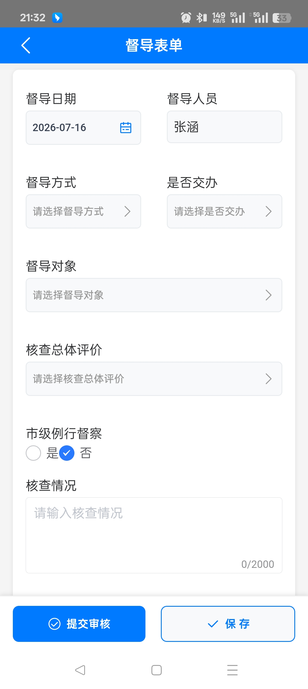

**模拟数据**（`mock.supForm`）：

```json
{
  "督导日期": "2026-07-16",
  "督导人员": "张涵",
  "督导方式": "现场检查",
  "是否交办": "不交办",
  "督导对象": "巫山县人民政府",
  "核查总体评价": "核查情况基本符合",
  "市级例行督察": "否",
  "核查情况": ""
}
```

---

### 4.2 线索问题列表

切换到 **「线索问题」**，进入线索问题列表。支持关键词搜索、更多条件筛选、列表展示、列表操作与新增线索。

列表展示下列字段：

| 字段 | 是否字典项 | 数据来源 | 备注 |
|------|------------|----------|------|
| 线索标题 | 否 |  |  |
| 编号 | 否 |  |  |
| 行政区划 | 否 |  |  |
| 领域 | 否 |  |  |
| 来源 | 是 | 字典 `clue_workbench_source` | 督察发现 / 信访投诉 / 媒体曝光 / 群众举报 / 其他 |
| 发现时间 | 否 |  |  |
| 发现情况 | 否 |  |  |
| 状态 | 否 |  |  |

列表为空时展示空态。

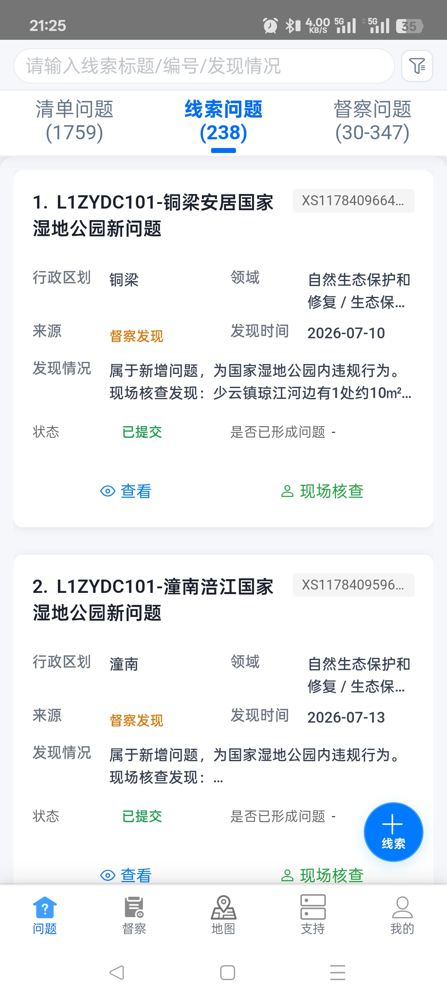

**模拟数据**（`mock.wbClue`）：

```json
[
  {
    "线索标题": "L1ZYDC101-铜梁安居国家湿地公园新问题",
    "编号": "XS1178409664",
    "行政区划": "铜梁",
    "领域": "自然生态保护和修复",
    "来源": "督察发现",
    "发现时间": "2026-07-10",
    "发现情况": "现场核查发现相关设施未按要求处置",
    "状态": "已提交",
    "是否已形成问题": "-"
  }
]
```

#### 搜索与更多条件

支持按线索标题 / 编号 / 发现情况检索（占位：「请输入线索标题/编号/发现情况」）。

支持打开「更多查询条件」（取消 / 重置 / 确定）。条件如下（字典可选值见备注列）：

| 字段 | 是否字典项 | 数据来源 | 备注 |
|------|------------|----------|------|
| 行政区划 | 否 |  |  |
| 领域 | 否 |  |  |

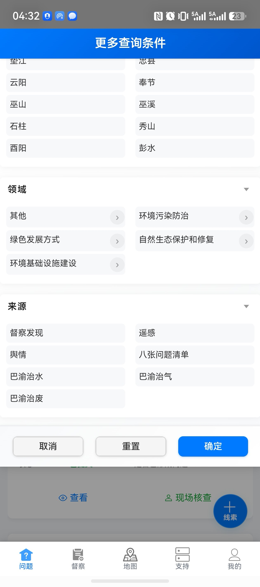

#### 查看 · 线索详情

在线索列表点击 **「查看」**，进入线索详情（标题为「线索详情」；舆情类为「舆情线索详情」）。本批无该页单独截图。支持分块查看：**线索信息（或舆情信息） / 督导信息 / 附件 / 线索照片**（舆情类不展示附件与照片）。

##### 线索信息（普通线索）

| 字段 | 是否字典项 | 数据来源 | 备注 |
|------|------------|----------|------|
| 线索编号 | 否 |  |  |
| 提交状态 | 否 |  |  |
| 发现日期 | 否 |  |  |
| 行政区划 | 否 |  |  |
| 领域 | 否 |  |  |
| 来源 | 是 | 字典 `clue_workbench_source` | 督察发现 / 信访投诉 / 媒体曝光 / 群众举报 / 其他 |
| 经度 | 否 |  |  |
| 纬度 | 否 |  |  |
| 创建时间 | 否 |  |  |
| 更新时间 | 否 |  |  |
| 标题 | 否 |  |  |

##### 舆情信息（舆情线索）

| 字段 | 是否字典项 | 数据来源 | 备注 |
|------|------------|----------|------|
| 序号/编号 | 否 |  |  |
| 提交状态 | 否 |  |  |
| 时间 | 否 |  |  |
| 来源渠道 | 是 | 字典 `clue_opinion_channel` |  |
| 媒体分类 | 是 | 字典 `clue_media_category` |  |
| 行政区划 | 否 |  |  |
| 污染源领域 | 是 | 字典 `clue_pollution_domain` |  |
| 污染源细化分类 | 是 | 字典 `clue_pollution_domain_detail` |  |
| 经度 | 否 |  |  |
| 纬度 | 否 |  |  |
| 创建时间 | 否 |  |  |
| 更新时间 | 否 |  |  |
| 标题 | 否 |  |  |
| 内容 | 否 |  |  |
| 链接 | 否 |  |  |

##### 督导信息

| 字段 | 是否字典项 | 数据来源 | 备注 |
|------|------------|----------|------|
| 督导人员 | 否 |  |  |
| 督导时间 | 否 |  |  |
| 督导方式 | 是 | 字典 `supervision_method` | 现场检查 / 书面督导 / 视频督导 |
| 部门名称 | 否 |  |  |
| 风险等级 | 是 | 字典 `supervision_risk_level` | 未评估 / 低风险 / 中风险 / 高风险 |
| 线索评估 | 是 | 字典 `supervision_clue_evaluation` | 有效线索 / 无效线索 |
| 督导进度 | 是 | 字典 `is_assigned` | 交办 / 不交办 |
| 督导状态 | 是 | 字典 `supervision_audit_status` | 待审核 / 审核通过 / 审核驳回 |
| 市级例行督察 | 是 | 字典 `is_municipal_routine` | 是 / 否 |
| 督察组 | 否 |  |  |
| 督察批次 | 否 |  |  |
| 督察意见 | 否 |  |  |
| 核查情况 | 否 |  |  |
| 督办建议 | 否 |  |  |
| 图像附件 | 否 |  |  |
| 视频附件 | 否 |  |  |
| 问题移交函 | 否 |  |  |
| 督察督办函 | 否 |  |  |
| 约见 | 否 |  |  |

##### 附件 / 线索照片

| 字段 | 是否字典项 | 数据来源 | 备注 |
|------|------------|----------|------|
| 附件 | 否 |  |  |

**模拟数据**（`mock.clueDetail`）：

```json
{
  "线索编号": "XS1178409664",
  "提交状态": "已提交",
  "发现日期": "2026-07-10",
  "行政区划": "铜梁",
  "领域": "自然生态保护和修复",
  "来源": "督察发现",
  "标题": "L1ZYDC101-铜梁安居国家湿地公园新问题",
  "发现情况": "现场核查发现相关设施未按要求处置",
  "督导信息": {
    "督导人员": "秦莉华",
    "督导时间": "2026-07-16",
    "督导方式": "现场检查",
    "线索评估": "有效线索",
    "督导状态": "审核通过"
  }
}
```

#### 修改 / 新增 · 线索表单

- 草稿点击 **「修改」**，进入编辑线索表单。
- 通过 **新增入口** 进入新增线索表单。

本批无该页单独截图。标题随模式为「新增线索 / 编辑线索」；舆情对应「新增/编辑舆情线索」。新增时可切换来源（含「舆情」）。支持 **保存并提交**；非督导场景另有 **保存**。

##### 发现类线索

| 字段 | 是否必填 | 组件类型 | 数据来源 | 备注 |
|------|----------|----------|----------|------|
| 线索标题 | 是 | 单行文本 |  |  |
| 发现情况 | 是 | 多行文本 |  |  |
| 行政区划 | 是 | 区划选择 |  |  |
| 领域 | 是 | 选择器 |  |  |
| 来源 | 是 | 单选 | 字典 `clue_workbench_source` | 督察发现 / 遥感 / 八张问题清单 / 巴渝治水 / 巴渝治气 / 巴渝治废 等 |
| 发现日期 | 是 | 日期选择 |  |  |
| 定位数据 | 否 | 地图选点 |  |  |
| 附件 | 否 | 文件上传 |  |  |
| 线索照片 | 否 | 图片上传 |  |  |

##### 舆情类线索

| 字段 | 是否必填 | 组件类型 | 数据来源 | 备注 |
|------|----------|----------|----------|------|
| 时间 | 是 | 日期时间选择 |  |  |
| 标题 | 是 | 单行文本 |  |  |
| 内容 | 是 | 多行文本 |  |  |
| 来源 | 是 | 单选 | 字典 `clue_opinion_channel` |  |
| 媒体分类 | 否 | 单选 | 字典 `clue_media_category` |  |
| 行政区划 | 是 | 区划选择 |  |  |
| 污染源领域 | 否 | 单选 | 字典 `clue_pollution_domain` |  |
| 污染源细化分类 | 否 | 单选 | 字典 `clue_pollution_domain_detail` |  |
| 链接 | 否 | 单行文本 |  |  |
| 回复情况 | 否 | 多行文本 |  |  |
| 定位数据 | 否 | 地图选点 |  |  |

草稿状态下还可在列表内点击 **「删除」「提交」**；已提交可点击 **「撤回」**。


**模拟数据**（`mock.clueForm`）：

```json
{
  "线索标题": "铜梁安居国家湿地公园新线索",
  "发现情况": "现场核查发现相关设施未按要求处置",
  "行政区划": "铜梁",
  "领域": "自然生态保护和修复",
  "来源": "督察发现",
  "发现日期": "2026-07-10",
  "定位数据": { "类型": "点", "点数": 1 }
}
```

#### 现场核查 · 督导表单

在已提交线索上点击 **「现场核查」**，打开的页面与清单侧 **「发起督导」** 的督导表单一致（本入口为新增督导记录），跳转至同一页面：§4.1.3。

---

### 4.3 督察问题列表

切换到 **「督察问题」**，进入督察问题列表。支持关键词搜索、更多条件筛选、按督察类型筛选、列表展示与列表操作。

列表展示下列字段：

| 字段 | 是否字典项 | 数据来源 | 备注 |
|------|------------|----------|------|
| 类型/编号标签 | 否 |  |  |
| 问题名称 | 否 |  |  |
| 整改主体 | 否 |  |  |
| 问题内容 | 否 |  |  |
| 整改措施 | 否 |  |  |
| 问题编号 | 否 |  |  |
| 整改状态 | 是 | 字典 `dcb_rectification_status` | 整改中 / 阶段性办结 / 已完成 |
| 督导状态 | 是 | 字典 `workbench_supervision_status` | 未核查 / 核查中 / 已核查 |
| 督导后风险 | 是 | 字典 `supervision_risk_level` | 未评估 / 低风险 / 中风险 / 高风险 |

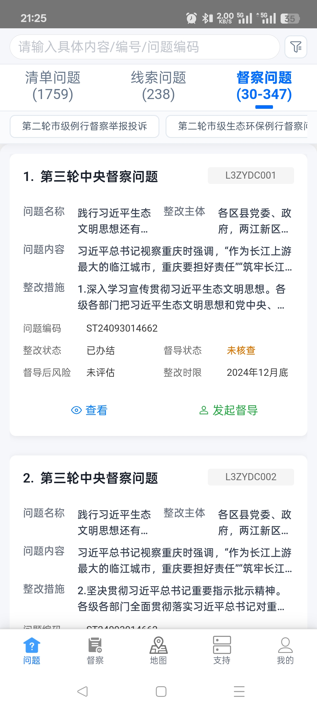

**模拟数据**（`mock.wbInspection`）：

```json
[
  {
    "类型/编号标签": "L3ZYDC001",
    "问题名称": "践行习近平生态文明思想还有差距",
    "整改主体": "各区县党委、政府",
    "问题内容": "习近平总书记视察重庆时强调…",
    "整改措施": "深入学习宣传贯彻习近平生态文明思想…",
    "问题编号": "ST24093014662",
    "整改状态": "整改中",
    "督导状态": "未核查",
    "督导后风险": "未评估",
    "整改时限": "2024年12月底"
  }
]
```

#### 搜索与更多条件

支持按具体内容 / 编号 / 问题编码检索（占位：「请输入具体内容/编号/问题编码」）。支持按督察类型筛选（如「第二轮市级例行督察举报投诉」等）。

支持打开「更多查询条件」。常规督察类型条件如下（字典可选值见备注列）：

| 字段 | 是否字典项 | 数据来源 | 备注 |
|------|------------|----------|------|
| 督导单位/责任单位 | 否 |  |  |
| 整改完成情况 | 是 | 字典 `dcb_rectification_status` | 整改中 / 阶段性办结 / 已完成 |
| 自查完成情况 | 是 | 字典 `sys_yes_no` | 是 / 否 |
| 自查风险情况 | 是 | 字典 `supervision_risk_level` | 高风险 / 中风险 / 低风险 |
| 督导状态 | 是 | 字典 `workbench_supervision_status` | 未核查 / 核查中 / 已核查 |
| 督导后风险状态 | 是 | 字典 `supervision_risk_level` | 未评估 / 低风险 / 中风险 / 高风险 |

其它类型条件组（本批无单独截图）：

| 类型场景 | 条件 |
|----------|------|
| 信访投诉 RIS | 污染类型；是否标*；区县（分组时） |
| 市级第二轮 | 批次；区县；整改状态；督导状态；督导后风险状态 |

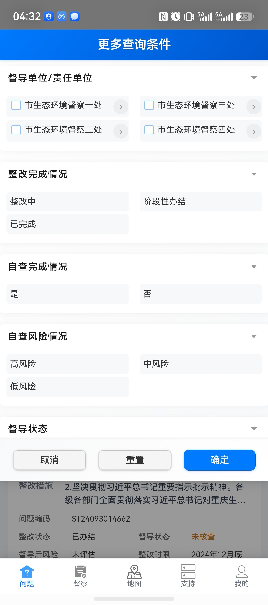

#### 查看 · 督察问题详情

在督察问题列表点击 **「查看」**，按当前所选督察类型进入对应详情。本批无各类型详情单独截图。下列按类型分别写字段。

公共说明：央督 7 类详情共用信息分区（基础信息 / 整改进度 / 自查内容 / 督导数据 / 回访信息(仅投诉类) / 遥感影像 / 位置信息）；市级第二轮为 3 个分区；例行督察举报投诉为 4 个分区。

##### 公共区块（央督 7 类共用）

**整改进度（默认 log）**

| 字段 | 是否字典项 | 数据来源 | 备注 |
|------|------------|----------|------|
| 完成情况 | 否 |  |  |
| 整改进度 | 否 |  |  |

**整改进度（二/三轮反馈 measures）**

| 字段 | 是否字典项 | 数据来源 | 备注 |
|------|------------|----------|------|
| 责任单位 | 否 |  |  |
| 整改措施 | 否 |  |  |
| 整改时限 | 否 |  |  |
| 办结情况 | 否 |  |  |

**自查内容**

| 字段 | 是否字典项 | 数据来源 | 备注 |
|------|------------|----------|------|
| 是否有问题 | 否 |  |  |
| 风险等级 | 是 | 字典 `supervision_risk_level` | 高风险 / 中风险 / 低风险 |
| 自查情况 | 否 |  |  |
| 自查反馈状态 | 否 |  |  |

**督导数据**

| 字段 | 是否字典项 | 数据来源 | 备注 |
|------|------------|----------|------|
| 督导人员 | 否 |  |  |
| 督导方式 | 是 | 字典 `supervision_method` | 现场检查 / 书面督导 / 视频督导 |
| 核查总体评价 | 是 | 字典 `overall_verification_evaluation` | 核查情况基本符合 / 核查发现整改有差距 / 核查发现整改不到位 / 核查发现虚假整改 |
| 督导状态 | 是 | 字典 `supervision_audit_status` | 待审核 / 审核通过 / 审核驳回 |
| 督导后风险 | 是 | 字典 `supervision_risk_level` | 未评估 / 低风险 / 中风险 / 高风险 |
| 市级例行督察 | 是 | 字典 `is_municipal_routine` | 是 / 否 |
| 督察组 | 否 |  |  |
| 督察批次 | 否 |  |  |
| 核查情况 | 否 |  |  |

**回访信息（仅投诉类）**

| 字段 | 是否字典项 | 数据来源 | 备注 |
|------|------------|----------|------|
| 来源板块 | 否 |  |  |
| 回访时间 | 否 |  |  |
| 回访人员 | 否 |  |  |
| 最新审核时间 | 否 |  |  |
| 回访时进展 | 否 |  |  |
| 群众对整改进度和效果是否满意 | 否 |  |  |
| 是否无法回访 | 否 |  |  |
| 无法回访原因 | 否 |  |  |
| 是否重复投诉 | 否 |  |  |
| 重复投诉解决 | 否 |  |  |
| 重复问题编号 | 否 |  |  |
| 反馈问题简述 | 否 |  |  |
| 是否解决 | 否 |  |  |
| 满意度 | 是 | 字典 `dcb_visit_satisfaction_level` | 满意 / 基本满意 / 不满意 |
| 是否反弹 | 否 |  |  |
| 风险等级 | 是 | 字典 `supervision_risk_level` |  |

**遥感影像 / 位置信息**

| 字段 | 是否字典项 | 数据来源 | 备注 |
|------|------------|----------|------|
| 坐标点位 | 否 |  |  |
| 实时遥感 | 否 |  |  |
| 历史遥感执行时间 | 否 |  |  |
| 历史遥感执行状态 | 否 |  |  |
| 历史遥感错误信息 | 否 |  |  |

###### 第一轮中央督察问题

| 字段 | 是否字典项 | 数据来源 | 备注 |
|------|------------|----------|------|
| 序号 | 否 |  |  |
| 整改时限 | 否 |  |  |
| 具体内容 | 否 |  |  |
| 牵头单位 | 否 |  |  |
| 责任单位 | 否 |  |  |
| 整改完成情况 | 否 |  |  |
| 整改进展 | 否 |  |  |
| 是否录入自查情况 | 否 |  |  |

###### 第一轮中央督察投诉

| 字段 | 是否字典项 | 数据来源 | 备注 |
|------|------------|----------|------|
| 序号 | 否 |  |  |
| 信访受理编号 | 否 |  |  |
| 办理单位 | 否 |  |  |
| 办理情况 | 否 |  |  |
| 举报主要内容 | 否 |  |  |
| 备注 | 否 |  |  |
| 投诉人 | 否 |  |  |
| 联系电话 | 否 |  |  |
| 是否录入自查情况 | 否 |  |  |

###### 第二轮中央督察问题

| 字段 | 是否字典项 | 数据来源 | 备注 |
|------|------------|----------|------|
| 序号 | 否 |  |  |
| 编号 | 否 |  |  |
| 整改牵头单位 | 否 |  |  |
| 整改责任单位 | 否 |  |  |
| 整改任务 | 否 |  |  |
| 整改措施 | 否 |  |  |
| 推进情况 | 否 |  |  |
| 整改时限 | 否 |  |  |

###### 第二轮中央督察投诉

| 字段 | 是否字典项 | 数据来源 | 备注 |
|------|------------|----------|------|
| 序号 | 否 |  |  |
| 案件编号 | 否 |  |  |
| 部门/区县 | 否 |  |  |
| 完成情况 | 否 |  |  |
| 问题内容 | 否 |  |  |
| 工作进展情况 | 否 |  |  |
| 调查核实情况 | 否 |  |  |
| 是否属实 | 否 |  |  |
| 是否有更新 | 否 |  |  |
| 是否录入自查情况 | 否 |  |  |

###### 第三轮中央督察问题

| 字段 | 是否字典项 | 数据来源 | 备注 |
|------|------------|----------|------|
| 序号 | 否 |  |  |
| 问题编号 | 否 |  |  |
| 问题名称 | 否 |  |  |
| 整改实施主体 | 否 |  |  |
| 问题内容 | 否 |  |  |
| 整改状态 | 否 |  |  |
| 整改时限 | 否 |  |  |
| 整改目标 | 否 |  |  |
| 整改措施 | 否 |  |  |
| 验收单位 | 否 |  |  |

###### 第三轮中央督察投诉

| 字段 | 是否字典项 | 数据来源 | 备注 |
|------|------------|----------|------|
| 序号 | 否 |  |  |
| 批次 | 否 |  |  |
| 受理编号 | 否 |  |  |
| 污染类型 | 否 |  |  |
| 举报内容 | 否 |  |  |
| 调查核实情况 | 否 |  |  |
| 责任单位 | 否 |  |  |
| 联系处室 | 否 |  |  |
| 重点关注 | 否 |  |  |
| 回访不满意 | 否 |  |  |
| 属实情况 | 否 |  |  |
| 是否办结 | 否 |  |  |
| 入库情况 | 否 |  |  |
| 督导单位督办情况 | 否 |  |  |

###### 长江经济带生态环境警示片披露问题

| 字段 | 是否字典项 | 数据来源 | 备注 |
|------|------------|----------|------|
| 序号 | 否 |  |  |
| 年份 | 否 |  |  |
| 省份 | 否 |  |  |
| 城市 | 否 |  |  |
| 整改时限 | 否 |  |  |
| 整改责任单位 | 否 |  |  |
| 整改验收单位 | 否 |  |  |
| 录入自查情况 | 否 |  |  |
| 移交问题表述 | 否 |  |  |
| 整改目标 | 否 |  |  |
| 整改措施 | 否 |  |  |
| 整改进展 | 否 |  |  |
| 是否完成整改 | 否 |  |  |
| 是否通过验收 | 否 |  |  |
| 是否完成销号 | 否 |  |  |

###### 第二轮市级例行督察问题

信息分区：基础信息 / 整改进度 / 督导数据。

**基础信息**

| 字段 | 是否字典项 | 数据来源 | 备注 |
|------|------------|----------|------|
| 整改编号 | 否 |  |  |
| 批次 | 否 |  |  |
| 区县 | 否 |  |  |
| 问题内容 | 否 |  |  |
| 整改目标 | 否 |  |  |
| 问题整改时限 | 否 |  |  |
| 整改实施主体 | 否 |  |  |

**整改进度**

| 字段 | 是否字典项 | 数据来源 | 备注 |
|------|------------|----------|------|
| 整改实施主体 | 否 |  |  |
| 验收单位 | 否 |  |  |
| 整改措施 | 否 |  |  |
| 措施整改时限 | 否 |  |  |
| 整改状态 | 否 |  |  |

**督导数据**

| 字段 | 是否字典项 | 数据来源 | 备注 |
|------|------------|----------|------|
| 督导人员 | 否 |  |  |
| 督导方式 | 是 | 字典 `supervision_method` | 现场检查 / 书面督导 / 视频督导 |
| 核查总体评价 | 是 | 字典 `overall_verification_evaluation` | 核查情况基本符合 / 核查发现整改有差距 / 核查发现整改不到位 / 核查发现虚假整改 |
| 督导状态 | 是 | 字典 `supervision_audit_status` | 待审核 / 审核通过 / 审核驳回 |
| 督导后风险 | 是 | 字典 `supervision_risk_level` | 未评估 / 低风险 / 中风险 / 高风险 |
| 核查情况 | 否 |  |  |

###### 第二轮市级例行督察举报投诉

信息分区：基础信息 / 反馈摘要 / 督导数据 / 回访信息。

**基础信息**

| 字段 | 是否字典项 | 数据来源 | 备注 |
|------|------------|----------|------|
| 轮次批次 | 否 |  |  |
| 受理编号 | 否 |  |  |
| 区县 | 否 |  |  |
| 举报途径 | 否 |  |  |
| 是否标* | 否 |  |  |
| 污染类型 | 否 |  |  |
| 主要内容 | 否 |  |  |

**反馈摘要**

| 字段 | 是否字典项 | 数据来源 | 备注 |
|------|------------|----------|------|
| 是否属实 | 否 |  |  |
| 是否办结 | 否 |  |  |
| 现场核查情况 | 否 |  |  |
| 办结目标 | 否 |  |  |
| 处理和整改情况 | 否 |  |  |

督导数据、回访信息字段同上文公共区块。

**模拟数据**（`mock.dcbDetail`）：

```json
{
  "类型": "第三轮中央督察问题",
  "基础信息": {
    "序号": "1",
    "问题编号": "ST24093014662",
    "问题名称": "践行习近平生态文明思想还有差距",
    "整改实施主体": "各区县党委、政府",
    "问题内容": "习近平总书记视察重庆时强调…",
    "整改状态": "整改中",
    "整改时限": "2024年12月底"
  },
  "督导数据": {
    "督导人员": "秦莉华",
    "督导方式": "现场检查",
    "督导状态": "未核查",
    "督导后风险": "未评估"
  }
}
```


#### 发起督导 · 督导表单

在督察问题列表点击 **「发起督导」**，打开的页面与清单侧 **「发起督导」** 的督导表单一致，跳转至同一页面：§4.1.3。

---

## 5. 督察

进入 **「督察」** 业务。可在 **督导 / 交办 / 督办 / 资料调阅 / 问责** 间切换。

本说明书**仅按「督导」**写列表与操作（含列表操作、新增入口；表单见 §4.1.3）。其余业务（交办 / 督办 / 资料调阅 / 问责）的列表、操作与详情/表单入口**均按「督导」同一套实现**（字段与交互一致，仅业务数据与当前选中项不同），不另开章节。

### 5.1 督导列表

进入后默认落在 **「督导」**。支持搜索、业务切换、列表展示、列表操作与新增。

列表展示下列字段：

| 字段 | 是否字典项 | 数据来源 | 备注 |
|------|------------|----------|------|
| 处室 | 否 |  |  |
| 督导日期 | 否 |  |  |
| 督导人员 | 否 |  |  |
| 督导方式 | 是 | 字典 `supervision_method` | 现场检查 / 书面督导 / 视频督导 |
| 市级例行督察 | 是 | 字典 `is_municipal_routine` | 是 / 否 |
| 问题名称 | 否 |  |  |
| 业务类型 | 否 |  |  |
| 审核状态 | 是 | 字典 `supervision_audit_status` | 待审核 / 审核通过 / 审核驳回 |
| 核查情况 | 否 |  |  |

业务列表为空时展示空态占位。

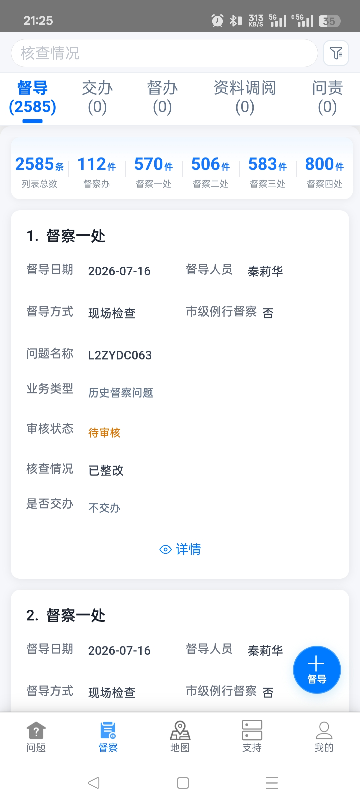

**模拟数据**（`mock.supList`）：

```json
[
  {
    "处室": "督察一处",
    "督导日期": "2026-07-16",
    "督导人员": "秦莉华",
    "督导方式": "现场检查",
    "市级例行督察": "否",
    "问题名称": "L2ZYDC063",
    "业务类型": "历史督察问题",
    "审核状态": "待审核",
    "核查情况": "已整改",
    "是否交办": "不交办"
  }
]
```

#### 详情 / 编辑 / 提交审核 / 删除

在督导列表上：

- 点击 **「详情」** 或 **「编辑」**，打开的页面与清单侧 **「发起督导」** 的督导表单一致（只读 / 编辑态由入口决定），跳转至同一页面：§4.1.3。
- 点击 **「提交审核」** 或 **「删除」**，在列表内完成对应操作。

通过 **新增入口** 打开的页面同样与督导表单一致，跳转至同一页面：§4.1.3。

其它业务下的详情 / 编辑 / 新增等入口，同样跳转至 §4.1.3 同一套页面（仅数据随当前业务变化）。


---

## 6. 地图

进入 **「地图」**，打开督察地图。

### 6.1 督察地图

支持按类型筛选、关键词搜索、地图展示点位与定位。无点位时仅显示底图。

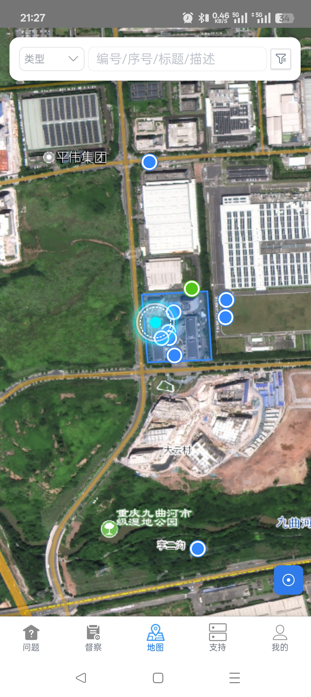

**模拟数据**（`mock.mapMain`）：

```json
{
  "当前类型": "全部",
  "关键词": "",
  "点位": [
    { "编号": "L1QZTS1357", "类型": "督察问题", "标题": "渝北区某雷达导航塔周边群众反映辐射担忧" },
    { "编号": "ST26042920094", "类型": "督察问题", "标题": "綦江区矿井水整治效果需持续巩固" }
  ]
}
```

#### 6.1.1 地图详情

在地图上点选某个点位，可查看详情（含标题、关闭、详情字段、导航）。可关闭返回地图；可发起导航。

| 字段 | 是否字典项 | 数据来源 | 备注 |
|------|------------|----------|------|
| 编号 | 否 |  |  |
| 类型标签 | 否 |  |  |
| 内容 | 否 |  |  |
| 批次 | 否 |  |  |
| 整改完成情况 | 否 |  |  |
| 责任单位 | 否 |  |  |

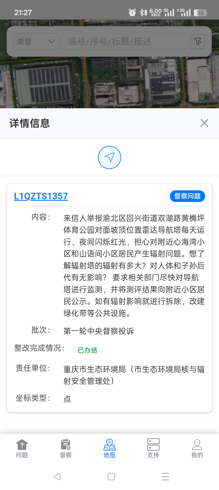

**模拟数据**（`mock.mapDetail`）：

```json
{
  "编号": "L1QZTS1357",
  "类型标签": "督察问题",
  "内容": "渝北区某雷达导航塔周边群众反映辐射担忧并申请监测",
  "批次": "第一轮中央督察投诉",
  "整改完成情况": "已办结",
  "责任单位": "重庆市生态环境局（核与辐射安全管理处）",
  "坐标类型": "点"
}
```

---

## 7. 支持

进入 **「支持」**，打开督察支持。

### 7.1 督察支持 · 资源

页面标题为「督察支持」。支持按名称（或内容，视配置）检索，并支持按分类筛选。列表可为空。

列表项字段：

| 字段 | 是否字典项 | 数据来源 | 备注 |
|------|------------|----------|------|
| 文件名 | 否 |  |  |

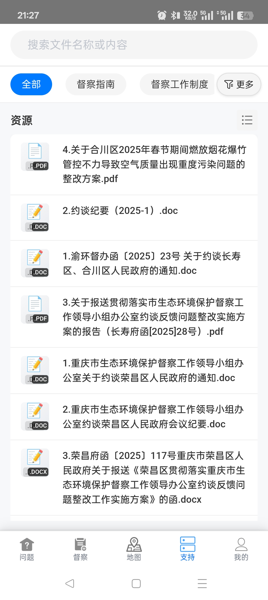

**模拟数据**（`mock.supportFiles`）：

```json
[
  {
    "文件名": "4.关于合川区2025年春节期间燃放烟花爆竹管控不力…整改方案.pdf",
    "文件类型": "pdf"
  },
  {
    "文件名": "2.约谈纪要 (2025-1).doc",
    "文件类型": "doc"
  }
]
```

---

## 8. 截图索引

| 文件 | 挂载章节 |
|------|----------|
| screen_14.jpg | §4.1 清单列表；§4.1.2 问题管理入口 |
| 问题模块-清单问题-搜索条件.jpg | §4.1.1 清单问题更多查询条件 |
| screen_13.jpg | §4.2 线索列表 / 列表操作 |
| 问题模块-督察问题-搜索条件.jpg | §4.2 线索问题更多查询条件 |
| screen_12.jpg | §4.3 督察问题列表 / 列表操作 |
| 问题模块-清单-搜索条件.jpg | §4.3 督察问题更多查询条件 |
| screen_04.jpg / screen_06.jpg | §4.1.2 问题详情 |
| screen_03.jpg / screen_05.jpg | §4.1.2 整改信息（有数据/空态） |
| screen_02.jpg | §4.1.2 督导信息 |
| screen_01.jpg | 各入口督导表单 |
| screen_10.jpg | §5.1 督导列表 / 列表操作 |
| screen_15.jpg | §6.1 督察地图 |
| screen_09.jpg | §6.1.1 地图详情 |
| screen_08.jpg | §7.1 督察支持 |

